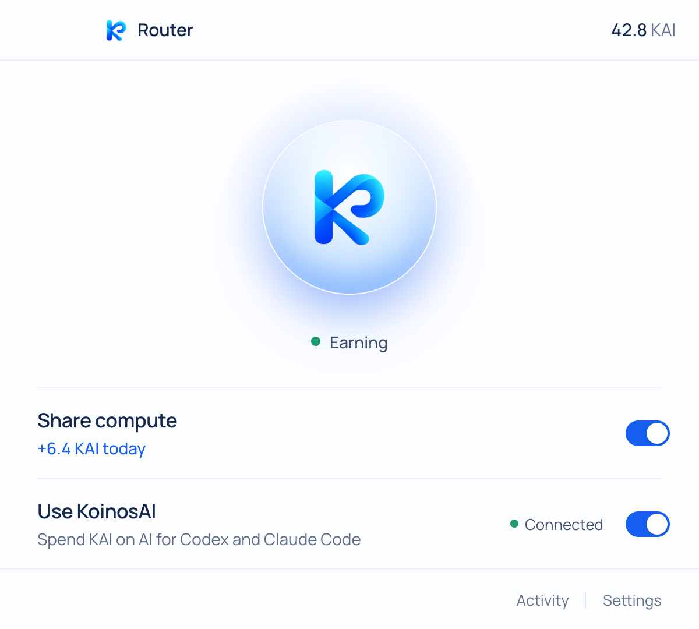
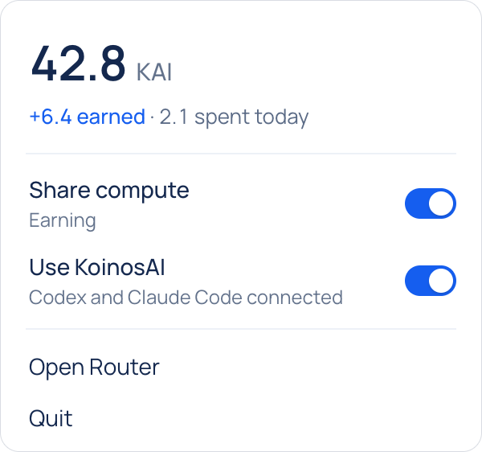

# Koinos Router

Koinos Router is a macOS menu-bar app with two switches:

- **Share compute** earns KAI by serving Koinos Network jobs while your Mac is idle.
- **Use KoinosAI** lets Codex and Claude Code hand small text jobs (summarize a log, classify
  items, extract fields, convert formats, draft boilerplate) to cheaper network models, paid in KAI.
  Router adds one MCP tool, `delegate`, to each harness. The agent decides when to use it.

<p>
  
  &nbsp;
  
</p>

## Download

**[Download the latest release](https://github.com/levineam/koinos-router/releases/latest)**:
`Koinos-Router-<version>-arm64.dmg`, or the `.zip` with the same app in it. To check the download,
save the release's `SHA256SUMS.txt` next to it and run
`shasum -a 256 -c --ignore-missing SHA256SUMS.txt` in that folder.

You need a Mac with Apple Silicon (M1 or later) and macOS 12 Monterey or later. Intel Macs aren't
supported in this release. To spend KAI you also need Codex or Claude Code (CLI or desktop app).

### Install

1. Open the DMG and drag **Koinos Router** onto **Applications**. (With the zip: double-click it,
   then move `Koinos Router.app` into Applications.) Always run it from Applications, not from the
   DMG or your Downloads folder: a copy opened from there doesn't set itself to open at login.
2. Open Koinos Router from Applications. **macOS blocks the first open**: this build isn't signed
   with an Apple Developer ID or notarized by Apple yet, so macOS says it can't check the app for
   malware. Click **Done** (not Move to Trash).
3. Open **System Settings › Privacy & Security**, scroll down to **Security**, and click **Open
   Anyway** next to "Koinos Router was blocked". Confirm with your login password or Touch ID, and
   choose **Open Anyway** again when macOS asks. The button is only there for about an hour after
   you tried to open the app; if it's gone, repeat step 2.

Or skip steps 2 and 3 with one Terminal command, then open the app normally:

```sh
xattr -dr com.apple.quarantine "/Applications/Koinos Router.app"
```

It removes the "downloaded from the internet" flag from that one app. Only run it on a copy you
downloaded from the release page above. It also clears "Koinos Router is damaged and can't be
opened", which is the same block in other words.

You do this once per version you download, until Router is notarized. Older macOS: on macOS 13 and
14 the steps are the same; on macOS 12 the button is in System Preferences › Security & Privacy ›
General. Before macOS 15 you can also Control-click the app in Applications and choose **Open**.

### First run

- Router opens its window on **Welcome**. Click **Get started**, connect Codex and/or Claude Code
  on **Connect your tools**, then **Done**. Router creates a wallet for you (there is no password to
  pick) and turns on both switches. Start a **new** Codex or Claude Code session so it loads the
  `koinos` tool.
- Connect adds a `koinos` server to `~/.codex/config.toml` or `~/.claude.json` and a small
  `koinos-delegate` skill. Router copies each config file once before its first change
  (`*.koinos-router.bak`) and never touches `CLAUDE.md` or `AGENTS.md`.
- Already use Router on another Mac? Choose **I already use Koinos Router on another Mac** on
  Welcome and paste that Mac's recovery key. Both Macs then spend from one balance; Router leaves
  Share compute off on this one (see Known limitations).
- **Keychain.** Router keeps its secrets encrypted with a key in your login Keychain, "Koinos Router
  Safe Storage". Router creates that item itself, so a fresh install asks for nothing. After you
  install a newer version, macOS may ask once for your login password before the new copy can use
  it: until Router is signed with a Developer ID, every version is a different app to the Keychain.
  Router says so first ("One quick permission"). Enter your login password and choose **Always
  Allow**. If you choose Deny, the wallet stays locked (no sharing or spending) until you choose
  Try Again or restart Router.
- **Back up your recovery key**: Settings › Wallet › Back up (Touch ID or your login password). It
  is the only way to get your balance back after deleting Router or moving to another Mac.

### What to expect

- **KAI is testnet.** It has no cash value.
- **Share compute** downloads the model engine and a model (about 2.5 GB) the first time it runs.
  The row shows "Getting ready · N%" meanwhile.
- On a laptop it shares only when the Mac is **plugged in** and has been **idle for 5 minutes**, and
  stops within seconds when you come back. While it waits for you to step away, the row offers
  **Start now** (it switches Settings › When to Always). To share on battery, turn off Settings ›
  Only when plugged in. A desktop Mac shares whenever it's on, even while you use it (Settings ›
  When).
- **Use KoinosAI** spends KAI only when Codex or Claude Code decides to call `delegate`. Activity
  lists each delegation and what it cost. The daily limit is 10 KAI (Settings › Daily limit).
- Tasks you delegate run on other people's Macs, and they can read them. Router refuses files that
  look private (`.env`, keys, `.ssh/`, `~/Library`) and anything that looks like a secret, and the
  agent gets the reason. Don't delegate code or data you need to keep private.

### Where it lives

- Router lives in the **menu bar**: the K icon with your balance next to it. Click it for the
  switches; right-click for Open Router and Quit Koinos Router. There is no Dock icon.
- On a MacBook with a notch, a crowded menu bar can hide the icon behind the notch (Router's
  window says so once). Open Koinos Router from Applications or Spotlight to bring up its window;
  this works while it's running too.
- Router opens at login (Settings › Open at login). It starts quietly in the menu bar then.

### Updates

Router doesn't update itself yet. Once a day it asks GitHub whether a newer release is out (one
request to `api.github.com`; nothing about you or your wallet is sent). When there is one, the
menu-bar popover shows **Update available**, and Settings › Version has a **Download** button that
opens the release page. Settings › Version also shows which version you have.

To update: quit Router, download the new DMG, drag Koinos Router onto Applications and choose
**Replace**, then open it. Expect Open Anyway again and the one-time Keychain prompt above. Your
wallet, settings and connections stay.

### Uninstall

1. In **Settings**, **Disconnect** Codex and Claude Code. This removes Router's `koinos` entry and
   skill from their configs; otherwise they keep pointing at a server that's gone.
2. If you want to keep your balance, back up your recovery key (Settings › Wallet › Back up).
3. Quit Router: right-click the menu-bar icon › Quit Koinos Router (or Quit in its popover).
4. Drag **Koinos Router** from Applications to the Trash.
5. Optional: delete `~/Library/Application Support/Koinos Router`. **This deletes your wallet.**
   Without the recovery key, the KAI in it is gone for good. You can also delete the "Koinos Router
   Safe Storage" item in Keychain Access, and remove Koinos Router from System Settings › General ›
   Login Items if it's still listed.

### Feedback

Open an issue at https://github.com/levineam/koinos-router/issues with your Mac model, macOS
version, what you did and what happened. Router's log is
`~/Library/Application Support/Koinos Router/core/core.log`; look it over before you attach it.

---

The rest of this file is for working on Router.

It is built on KoinosAI Core from this repo (the `router` profile of `createCore`). The full
KoinosAI app is unchanged. Router has its own version (0.1.0); the Core it is built on is KoinosAI
0.54.12.

More detail: `docs/MVP_SPEC.md` (what it does and why) and `router/ARCHITECTURE.md` (module
contracts, exact copy, HTTP surface).

## Run from source

You need macOS on Apple Silicon and Node.js 22 or later (the test scripts use `node --test` with
glob patterns, which Node 20 doesn't support).

```sh
npm install
npm run router
```

This starts the real app, against the live network (koinosai.com). Know before you run it:

- It uses the same data folder as an installed Koinos Router
  (`~/Library/Application Support/Koinos Router`). If Router is already running, the second copy
  just brings the first one forward and exits.
- **Connect** edits your real `~/.codex/config.toml` and `~/.claude.json`.
- The Electron binary in `node_modules` is a different app to the Keychain than an installed
  build, so switching between the two brings up the Keychain prompt described below.

To run a separate copy that leaves your real Router and harness configs alone, point it at temp
folders:

```sh
KOINOS_ROUTER_DATA="$(mktemp -d)" KOINOS_ROUTER_HARNESS_HOME="$(mktemp -d)" npm run router
```

If port 41110 is taken, Router listens on a port the OS picks. Use the local demo below to keep
it off the live network too.

Headless check that everything boots (fresh temp data folder, removed on exit; prints
`SMOKE OK <port>` and exits 0):

```sh
npm run router:smoke
```

In scripts and CI, start Router only with `--smoke` or with a temp `KOINOS_ROUTER_DATA`: a normal
run uses your real wallet and data.

## Local demo (fake network)

```sh
npm run router:demo            # reuse the demo profile from last time
npm run router:demo -- --fresh # start over: new wallet, first-run screens
```

(`node router/scripts/local-demo.js [--fresh]` is the same thing.)

The demo runs the real app against a private stand-in for the network, so you can click through
onboarding, both switches, Start now, Activity and Settings without a live wallet, without
registering with koinosai.com, and without downloading a model.

- **Fake:** the scheduler (the in-repo fixture `server/scheduler.js`, on a random local port) and
  the model server (`core/test/fixtures/fake-llama-server`, which answers every prompt with
  "Hello from fake llama"). Sharing is pinned to the tiny `dev-tiny` model with a placeholder
  file, so nothing downloads.
- **Real:** the Electron shell, Core, the Router service, the MCP endpoint, the ledger, the idle
  policy, and the Keychain-backed secrets.
- **Sandboxed harness home:** `KOINOS_ROUTER_HARNESS_HOME` points at
  `$TMPDIR/koinos-router-demo/harness-home`, which has empty `.codex` and `.claude` folders so both
  tools show as found. Connect writes there, never to your real `~/.codex` or `~/.claude.json`.
  After Connect, `harness-home/.codex/config.toml` shows exactly what Router writes, including the
  MCP URL.
- The profile lives in `$TMPDIR/koinos-router-demo` (`core/` is the data folder). It has its own
  Electron profile, so it can run next to an installed Router.

Want to work on the pages without Electron or Core at all? `node router/ui/dev-mock.js` serves
them with an in-memory API at http://127.0.0.1:41190 (add `?scenario=earning`, `waiting`,
`paused`, `outofkai`, `preparing`, `firstrun`, `notools` or `update`; `update` shows the update
notice and the menu-bar hint).

## Build

```sh
npm run dist:router
```

Output: `dist-router/Koinos-Router-<version>-arm64.dmg` and `.zip` (the app itself is in
`dist-router/mac-arm64/`). `<version>` is Router's own version, `ROUTER_VERSION` in
`router/scripts/dist-router.js` (0.1.0); the repo's `package.json` keeps Core's (0.54.12). Extra
arguments go to electron-builder (`npm run dist:router -- --dir` builds only the app);
`KOINOS_ROUTER_ARCHS=arm64,x64` picks architectures (arm64 is the default and the only one
released). The build is configured in `router/electron-builder.yml`: menu-bar only
(`LSUIElement`), hardened runtime, Electron fuses that stop anything else running code inside the
app (no `ELECTRON_RUN_AS_NODE`, `NODE_OPTIONS` or `--inspect`; only the integrity-checked
`app.asar` loads), a DMG whose window is one drag onto Applications, and no update feed.

`dist:router` signs the app with the best code-signing identity in your keychain, in this order:
`KOINOS_ROUTER_SIGN_IDENTITY` if you set it (a name or SHA-1; `-` means ad-hoc), a Developer ID
Application, an Apple Development identity, the local "Koinos Router Local" identity (below), or
none (ad-hoc). It prints which one it used, and whether the build is notarized: only a Developer ID
build with notary credentials is (`router/scripts/notarize-router.js`; see ARCHITECTURE.md). Every
other build prints why not, and needs Open Anyway on other Macs.

### Release build (for other people's Macs)

A build you give to anyone else is built **ad-hoc**, whatever is in your keychain:

```sh
KOINOS_ROUTER_SIGN_IDENTITY=- npm run dist:router
```

An Apple Development certificate is for running your own builds on your own Macs. Apple's terms
don't cover giving builds signed with it to other people, and its certificate names your Apple ID
email, which every copy would carry; `dist:router` reminds you when it uses one. "Koinos Router
Local" only works on the Mac that made it. Until Router has a Developer ID, the ad-hoc build is what
testers install, with the Open Anyway step above.

Then get the files ready for GitHub:

```sh
npm run release:router:assets
```

It checks the DMG and the zip (valid signature, Router's version, the right architecture, not
signed with Apple Development, the DMG's Applications link and window), writes
`dist-router/SHA256SUMS.txt`, and prints the `gh release create router-v<version> …` command with
`router/RELEASE_NOTES-<version>.md` as the notes. It never runs `gh`, tags or pushes. The release
on `levineam/koinos-router` carries the DMG, the zip and `SHA256SUMS.txt`. Publish it as a normal
release (not a draft or prerelease): the Download link above and Router's update notice both read
`releases/latest`. Bump `ROUTER_VERSION` for every release. More in `router/ARCHITECTURE.md` ›
Releases.

## The Keychain prompt, and signing

Router keeps two random secrets (the wallet password and a session secret) encrypted with
Electron's `safeStorage`. The key for that lives in your login Keychain as
**"Koinos Router Safe Storage"**, and the Keychain only hands it to the build it trusted last.

| Build signed with | Keychain prompt |
|---|---|
| nothing (ad-hoc) | on the first launch of **every new build** |
| Apple Development or Developer ID (has an Apple team ID) | once; "Always Allow" survives rebuilds |
| the local "Koinos Router Local" identity | the same identity every build, but no team ID, so macOS may still ask once after a rebuild |

The very first install never asks: creating the key doesn't. A build copied to another Mac is new
to that Mac's Keychain too.

Router tells you before macOS asks: a packaged build whose signature differs from the one that last
opened the key shows "One quick permission" first. Enter your Mac login password in the macOS
dialog that follows and choose "Always Allow". If you choose Deny, Router shows "Wallet locked":
Try Again relaunches Router so macOS asks again; Not Now runs with the wallet locked (no sharing or
spending; the Share row says "Wallet locked · Restart Router") until the next launch.

Fewest prompts on your own Macs: sign with an **Apple Development** certificate. It is free with an
Apple ID (Xcode › Settings › Accounts › Manage Certificates) and `dist:router` picks it up by
itself. Never give anyone a build signed with it (see Release build).

No Apple ID handy? Make the local identity once, then rebuild:

```sh
npm run router:setup-signing     # same as: bash router/scripts/setup-dev-signing.sh
npm run dist:router
```

The script makes a self-signed code-signing certificate, "Koinos Router Local", in your login
keychain (only `/usr/bin/codesign` may use its key; no trust settings change). macOS asks for your
login keychain password once while it sets this up. Running it again changes nothing. To remove
it: Keychain Access › login › My Certificates › delete "Koinos Router Local" with its private key.
Check what a build was signed with:
`codesign -dv --verbose=2 "dist-router/mac-arm64/Koinos Router.app"` (look at `Authority` and
`TeamIdentifier`).

None of this helps on other Macs, and the Apple Development and local identities are not for
builds you give away (see Release build). Until Router has a Developer ID and is notarized, a build
copied to another Mac needs Open Anyway on first open (see Install), and every new version asks
once for the Keychain item there. A Developer ID, notarization and updates in place are planned
(MVP_SPEC §9, M5).

## Where data lives

| What | Where |
|---|---|
| Electron profile | `~/Library/Application Support/Koinos Router/` |
| Router data | `~/Library/Application Support/Koinos Router/core/` |
| — settings, switches, MCP token | `core/settings.json` |
| — activity (30 days) | `core/router-ledger.jsonl` (+ `.day.json`) |
| — wallet keystore and session | `core/wallet/` (an older keystore is kept as `wallet.json.bak-<time>` after a restore) |
| — wallet password, session secret | `core/wallet-password.bin`, `core/machine-secret.bin` (encrypted; key in the Keychain) |
| — model and engine downloads | `core/models/`, `core/runtimes/` |
| — which build last opened the Keychain key | `core/keychain-access.json` |
| — log | `core/core.log` |
| Keychain | login keychain item "Koinos Router Safe Storage" |
| Codex config | `~/.codex/config.toml` (`[mcp_servers.koinos]`), skill in `~/.codex/skills/koinos-delegate/` |
| Claude Code config | `~/.claude.json` (`mcpServers.koinos`), skill in `~/.claude/skills/koinos-delegate/` |
| Your original harness configs | `config.toml.koinos-router.bak`, `.claude.json.koinos-router.bak` (made once, before Router's first change) |

With `KOINOS_ROUTER_DATA=<dir>`, Router data goes to `<dir>` and the Electron profile to
`<dir>/electron`. With `KOINOS_ROUTER_HARNESS_HOME=<dir>`, the harness files above are under
`<dir>` instead of your home folder.

The wallet's recovery key is the only way to move your balance to another Mac or get it back.
Settings › Wallet › Back up shows it after Touch ID or your Mac login password. Keep it somewhere
private. On a new Mac, use "I already use Koinos Router on another Mac" on the Welcome screen.

To remove Router, follow Uninstall above: disconnect Codex and Claude Code in Settings first, back
up the recovery key, quit, then delete the app and, if you want, the data folder (that deletes the
wallet) and the Keychain item.

## Using it with Codex and Claude Code

1. Turn on **Use KoinosAI** (onboarding does it for you).
2. Connect Codex and/or Claude Code (Welcome › Connect your tools, or Settings).
3. Start a new Codex or Claude Code session so it loads the `koinos` server.

The agent calls `delegate` with a task and, for large input, absolute file paths, which Router
reads itself. Router refuses files that look private (`.env`, keys, `.ssh/`, `~/Library`, its own
data) and anything containing what looks like a secret, and tells the agent why. Answers come
back wrapped in `<untrusted_output>`, with a footer like `[koinos · koinos-smart · 0.03 KAI ·
2 chunks]`. On any error the tool tells the agent to do the task itself. The daily limit (default
10 KAI) is in Settings.

## Tests

```sh
npm run test:router   # Router suites only (about 440 tests)
npm test              # Core and Router
```

`npm test` has 6 known failures that come from the environment, not from Router: 5 in
`core/test/node-data-folder.browser.test.js` (no Chromium at `/opt/pw-browsers`) and 1 in
`core/test/ollama.test.js`. Router tests use temp folders, the in-repo scheduler fixture and a
fake model server. They never touch your home folder, harness configs, login keychain or the live
network.

## Known limitations

- Apple Silicon, macOS 12 or later.
- Not signed with a Developer ID and not notarized: each downloaded version needs Open Anyway (or
  the `xattr` command) once, and asks once for the Keychain item after an update. No automatic
  updates; Router only tells you a new version is out. Your own builds: unless you sign with an
  Apple Development identity, expect a Keychain prompt after each rebuild.
- The network today: 4,096-token context, answers of at most 512 tokens per part, text only, and
  one request at a time per wallet. A delegation can use at most 8 parts and takes up to 180 s.
- KAI is testnet. It has no cash value.
- One Mac per wallet should share compute. Router turns Share off after you restore a wallet, but
  it doesn't detect or stop a second Mac sharing on the same wallet; if both share, they knock
  each other off.
- "Earned today" is an estimate: any balance increase since Router's first balance read that day
  (a deposit too). Shared-compute rows in Activity have no KAI amount. "Spent today" is priced at
  published rates; the free daily allowance is used first, so your balance may drop by less.
- "Connected" means the harness config points at Router. Router doesn't call the tool itself to
  check, and a harness only sees a new connection in a new session.
- The model server runs at below-normal priority but has no thread cap.
- Anyone running a Share worker can read the tasks sent to them. The secret guard is
  pattern-based and can miss a secret in an unusual format, so don't delegate private code or data.
- The MCP URL, including its token, is stored in plain text in the harness configs; any program
  running as you can read it and spend KAI through `delegate`, within the daily limit.
- Restoring a recovery key is only offered on the Welcome screen.
